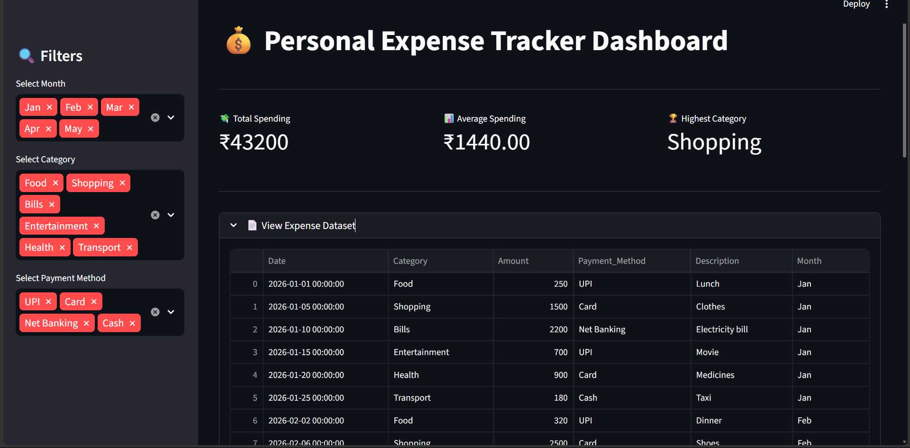
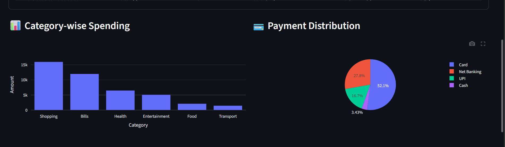
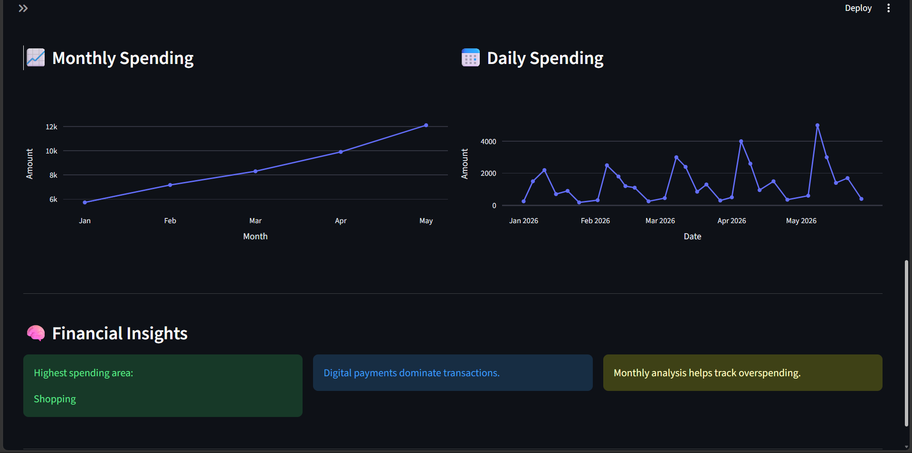

# 💰 Personal Expense Tracker Dashboard

An interactive and visually appealing Personal Expense Tracker Dashboard built using Python, Pandas, Plotly, and Streamlit.

This project helps users analyze their spending habits, monitor monthly expenses, and gain financial insights through interactive charts and filters.

---

# 🚀 Project Overview

Managing personal finances manually can be difficult and time-consuming.  
This project simplifies expense tracking by providing:

- Expense analysis
- Spending trends
- Payment method insights
- Interactive financial dashboard
- Data visualization

The dashboard allows users to:
- track expenses
- identify high spending categories
- analyze monthly trends
- monitor payment patterns

---

# 🎯 Features

✅ Interactive Streamlit Dashboard  
✅ Sidebar Filters  
✅ KPI Cards  
✅ Category-wise Expense Analysis  
✅ Monthly Spending Trends  
✅ Daily Spending Trends  
✅ Payment Method Distribution  
✅ Financial Insights Section  
✅ Responsive Plotly Charts  
✅ Dark Theme Dashboard  

---

# 🛠️ Tech Stack

- Python
- Pandas
- Plotly
- Streamlit

---

# 📂 Project Structure

```bash
Personal-Expense-Tracker-Dashboard/
│
├── app.py
├── requirements.txt
├── README.md
├── .gitignore
│
├── data/
│   └── expenses.csv
│
└── images/
    ├── dashboard-overview.png
    ├── analytics-charts.png
    └── sidebar-filters.png
```

---

# 📊 Dashboard Preview

## Sidebar Filters



---

## Analytics Charts



---
## Dashboard Overview



---

# 📈 Dashboard Analytics

The dashboard provides:

- Total Spending Analysis
- Average Daily Spending
- Highest Spending Category
- Category-wise Spending Analysis
- Monthly Expense Trends
- Daily Expense Trends
- Payment Method Distribution

---

# 🔍 Filters Available

Users can filter data based on:

- Month
- Expense Category
- Payment Method

The dashboard updates charts dynamically based on selected filters.

---

# ⚙️ Installation

## 1️⃣ Clone Repository

```bash
git clone https://github.com/skkiranmayee-789/Personal-Expense-Tracker-Dashboard.git
```

---

## 2️⃣ Navigate to Project Folder

```bash
cd Personal-Expense-Tracker-Dashboard
```

---

## 3️⃣ Create Virtual Environment

### Windows

```bash
python -m venv venv
venv\Scripts\activate
```

### Mac/Linux

```bash
python3 -m venv venv
source venv/bin/activate
```

---

## 4️⃣ Install Dependencies

```bash
pip install -r requirements.txt
```

---

# ▶️ Run Application

```bash
streamlit run app.py
```

---

# 📁 Dataset Information

The project uses a synthetic expense dataset containing:

- Date
- Expense Category
- Amount
- Payment Method
- Description

---

# 💡 Financial Insights

This dashboard helps users:

- identify overspending
- monitor financial habits
- analyze spending patterns
- improve budgeting decisions
- track payment preferences

---

# 📚 Learning Outcomes

Through this project, I learned:

- Data Analysis using Pandas
- Interactive Dashboard Development
- Data Visualization with Plotly
- Streamlit Application Development
- Financial Data Analytics
- Dashboard UI Design
- Filtering and Data Processing

---

# 🌟 Future Improvements

- Budget Prediction
- Expense Forecasting
- Authentication System
- Database Integration
- Export Reports as PDF/CSV
- Mobile Responsive Design

---

# 👩‍💻 Author

Developed as a Python Portfolio Project for learning:
- Python Development
- Data Analytics
- Visualization
- Dashboard Development
- Financial Analytics